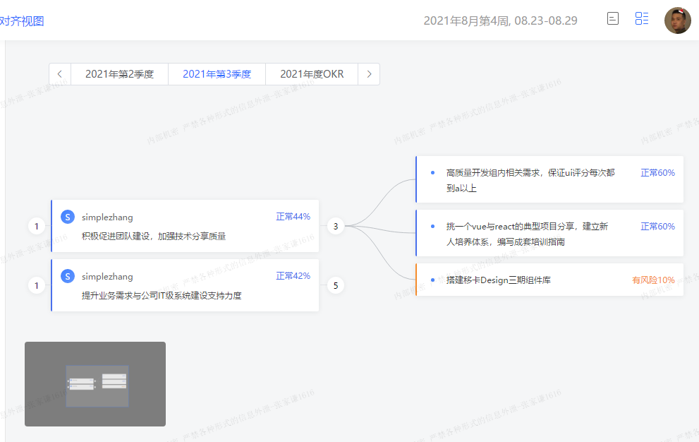

## <a id="whatis">是什么</a>
keywords:["缩略图","html2canvas","高度计算","居中定位","区分左右","dom性能","多节点展开"]

类似思维导图的画板。

对齐画板

提供对齐功能，每个独立的okr可以跟踪别人的okr

1. 缩略图：整个页面的dom转化为图片按比例缩小后按比例移动
2. 线条绘制：svg-path，getBoundingClientRect每个okr的高度然后均分连线
3. 子绝父相布局
4. 阻止事件冒泡
5. 根据后端数据自我递归
6. 区分左右

## <a id="issue">缺陷/优化</a>

采用dom结构的话会有性能瓶颈：当dom节点超过2000个的时候页面容易卡顿，可以用canvas重写。

子绝父相的定位方式：没法支持多个节点同时展开

## <a id="scenario">应用场景</a>

大型应用

## <a id="replacement">代替方案</a>

